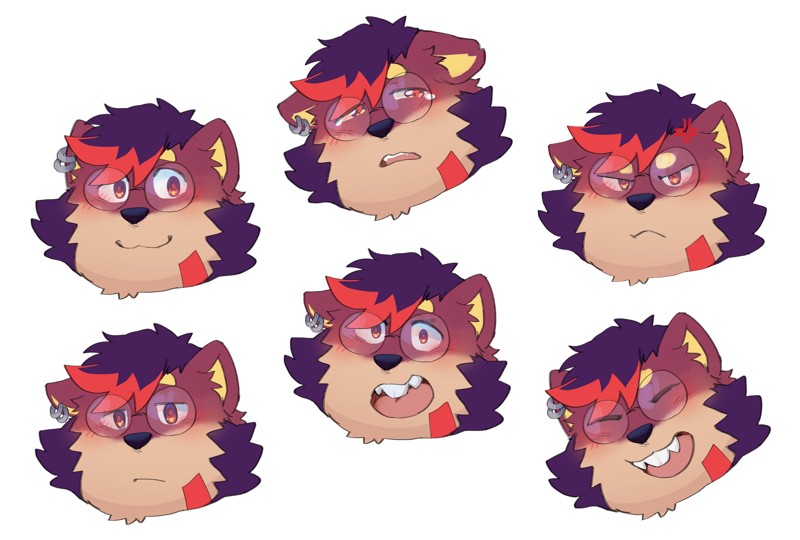

+++
title = "BOLE: Character Sheet"
description = "Artistic guidelines to That Charming BOLE's appearance and features for commissions and fanart."
+++

This is the definitive guide of my own character, Bole.
My fate now lies in your hands.
I hope you will take care of me well.

- **Species**: Rodent doggo (80 ‍‍% dog, 20 ‍‍% rodent)
- **Colors**:
   Beetroot,
   Orange,
   Lemon, and
   Eggplant.

> \[!IMPORTANT]
> When working on commissions or fanarts of my character,
> prioritize the color shades and names over precise color codes.
> Feel free to shift hues ever so slightly. Trust your own judgement.

### Mandatory Features

- Full and fluffy hair around these areas:
  the head, the mane, the armpits, the elbows, the crotch, and the tail.
  Other body parts are primarily covered with thin-haired pelage
  (i.e. extremely short fur).
- Zigzag-shaped pelage pigmentation pattern
  around the knee, the thigh, and the lateral area
  (dorsal – ventral boundary).
- Extruded front pair of incisors (cf. rabbit).
- Wearing two (2) earrings on the right ears,
  a pair of round glasses, and a face paint on the lower left cheek.
- Accented  Orange
  color on the hair tip, the face paint, the elbows, and the tail tip.

### Optional: Body Shape

Artists have magical powers to transform BOLE into different bodily shapes.
They must look inward to find their strength and decide how BOLE would look like,
whether it would be buff, lean, or anything in between.

### Attribution

Every illustration shown on this page was commissioned artworks,
co-designed and completed by @L4ZILY.
Find him on [Twitter](https://x.com/L4ZILY)
and [Bluesky](https://bsky.app/profile/l4zily.bsky.social).
